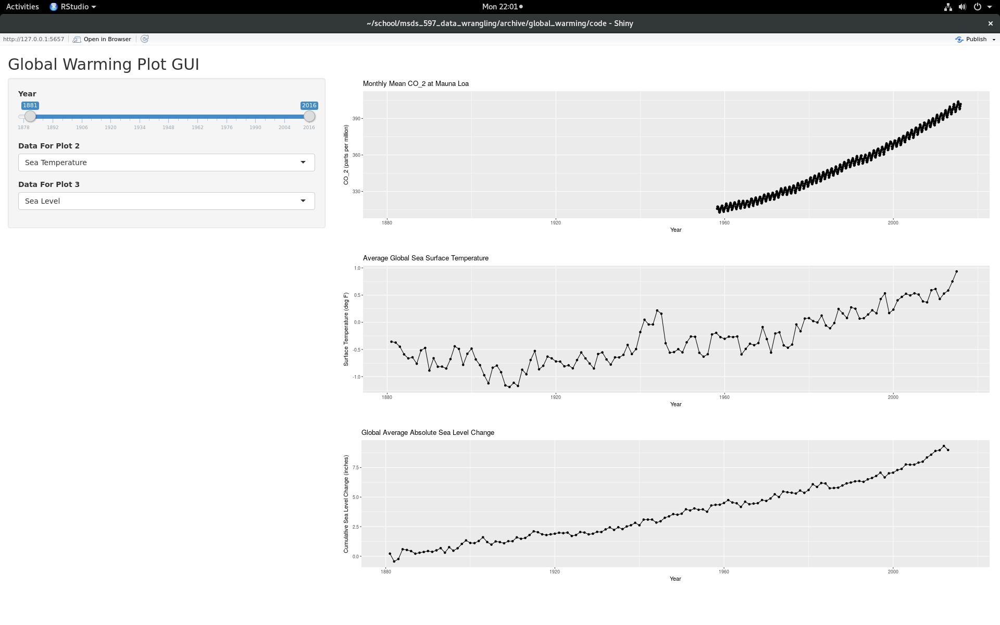

```{r setup, include=FALSE}
knitr::opts_chunk$set(echo = TRUE)
```
```{r, echo = FALSE, include = FALSE, message = FALSE, warning = FALSE} 
library(tidyverse)
library(RCurl)
library(stringr)
library(tidyr)
```

## Introduction
Leading up to the most recent presidential election, and after the election, there has been a lot of discussion about a class of people that are being referred to in the media as climate change deniers.  Discussions of members of this group being apointed to cabinet positions and to the heads of agencies such as the Envronmental Protection Agency prompted me to take a look at some of the raw climate change data to see how strong the link is between the human population of this planet and the symptoms of global warming that are currently available.  Because this has been a topic of conversation and study for quite some time now, there is a large amount of data available to look at.  Before we get to that though, a little background science is probably warranted.

## Global Warming
The basic concept that needs to be understood before looking at the data is what exactly is global warming?  Global warming is known by a number of different names including the greenhouse effect and climate change.  Despite the different names, the underlying science remains the same.  Energy from the sun radiates the Earth and and approximately 70% of this energy is absorbed by the Earth while the rest is reflected back out to space.  As the Earth heats up, it also releases heat in the form of IR thermal radiation which is radiated to space.  This 70/30 balance of absorbed to reflected energy is what makes this planet habitable to humans and other species that call this planet home and in that respect, the greenhouse effect is actually a good thing.  The problem lies in the make up of the Earth's atmosphere and how and why that make up is changing.  The atmosphere is made up of a number of different compounds, but for the purposes of looking a global warming, there are six main gasses that are a concern right now.  Carbon Dioxide, Methane, Nitrous Oxide, Hydrofluorocarbons, Perfluorocarbons, and Sulphur Hexaflouride.  These gasses are the green house gasses and they are called that becasue they absorb some of the energy reflected into the atmosphere and this in turn heats up the atmosphere.  For a long time, the concentrations of these compounds varied a little but remained basically the same.  The problem is that the concentrations of all of these green house gasses are rapidly climbing and they are climbing because of the human presence on this planet.  From cars to airplanes to powerplants to livestock to agriculture, the human race is driving the production of large amounts of greenhouse gasses that are significantly changing the make up of the Earth's atmosphere and signigicantly effecting the temperature of this planet.

## Data
### $CO_2$ Data
To quantify these effects its time to start looking at some data and the first data we are going to look at is concentrations of the greenhouse gas that humans produce more than any other, Carbon Dioxide.  The best source that I found for $CO_2$ data is the Earth Systems Research Labratory which is a division of the National Oceanic and Atmospheric Admisistration.  They maintain a couple of different data sets, the first of which is a record from about 140 years ago to 800,000 years ago.  This data was retrieved by drilling very deep ice cores from shelfs in Antarctica and looking at the amount of $CO_2$ that was trapped in the ice at different depths.  This is a fascinating look at the content of the atmosphere in times where we don't typically get a lot of great data.  The following code is used to download the file from the NOAA web site:

```{r, echo = TRUE, include = TRUE, message = FALSE, warning = FALSE} 
  file_name <- "edc-co2-2008.txt"
  url <- "https://www1.ncdc.noaa.gov/pub/data/paleo/icecore/antarctica/epica_domec/edc-co2-2008.txt"
  # download file
  download.file(url, file_name, method = "libcurl")
  # load file skipping comments at the begining
  co2_old <- read.table(file_name, skip = 774)
  # rename the data columns
  names(co2_old) <- c("age", "co2_ppm")
  # make the data frame a tibble
  co2_old <- as_tibble(co2_old)
```

In addition to the old $CO_2$ data, a newer set that starts in 1958 and goes to current day is available from NOAA as well.  This data set is also known as the Keeling data set after C. David Keeling,  the scientist who first started recording $CO_2$ concentrations in 1958.   The following code is used to download the file from the NOAA ftp site and get it cleaned up:

```{r, echo = TRUE, include = TRUE, message = FALSE, warning = FALSE} 
file_name <- "co2_mm_mlo.txt"
url <- "ftp://aftp.cmdl.noaa.gov/products/trends/co2/co2_mm_mlo.txt"
# download file
download.file(url, file_name, method = "libcurl")
# load file skipping comments at the begining
co2_recent <- read.table(file_name, skip = 71)
# rename the data columns
names(co2_recent) <- c("year", "month", "decimal_date", "average", "interpolated",
                       "season_corr", "num_days")
# transform the data frame to a tibble
co2_recent <- as_tibble(co2_recent)
# remove the -99.99s and replace them with NAs
co2_recent$average[co2_recent$average == -99.99] <- NA
```

Plotting these two data sets on the same plot paints a relatively stark picture of what the Earth's $CO_2$ levels are currently doing.  For 800,000 years, the $CO_2$ levels varied between 150 and 300 ppm and in the last 55 years they've risen steadily to over 400 ppm.

```{r, echo = FALSE, include = TRUE, message = FALSE, warning = FALSE} 
ggplot(co2_old, aes(-1*age, co2_ppm)) + geom_point(col = "blue") + geom_line(col = "blue") +
           geom_point(data = co2_recent, aes(decimal_date - 1958.208, interpolated), col = "orange") +
           geom_line(data = co2_recent, aes(decimal_date - 1958.208, interpolated), col = "orange") +
           ggtitle("Atmospheric Carbon Dioxide Concentration History") +
           labs(x = "Year", y = "Carbon Dioxide (parts per million)")
```

A zoom in of the orange portion of the above plot shows that from 1958 until present day, there is some seasonal variation, but $CO_2$ levels have risen steadily since the measurements began being taken.  Recently, scientists predicted that this planet will not see $CO_2$ levels below 400 ppm again in the forseeable future.

```{r, echo = FALSE, include = TRUE, message = FALSE, warning = FALSE} 
ggplot(co2_recent, aes(decimal_date, interpolated)) +
       geom_point(col = "orange") + geom_line(col = "orange") + 
       ggtitle("Monthly Mean Carbon Dioxide Concentration at Mauna Loa") +
       labs(x = "Year", y = "Carbon Dioxide (parts per million)")
```

This may not seem like a big deal, after all we are talking about an increase in terms of parts per a million.  Simillar increases, albeit at lower concentrations, are being seen in the other green house gasses.  The question now is, how have these increased levels of greenhouse gasses effected the planet?  To answer this question, the first place we'll look is at surface temperatures.

## Surface Temperatures
The oldest continuous temperature history of a location on this planet is a record from Hadley, England where the temperature has been recorded daily since 1659, the data grabbed for the purpose of this paper was the mean monthly and yearly temperature and that data set starts in 1878.  The temperature data was some of the most difficult to wrangle and clean.  In this case, the Hadley mean monthly and yearly temperature came in rows that were years with columns for each month and a column for yearly average.  This data had to be gathered into a tidy data set, have the month converted to an integer, and have some other miscellaneous cleaning done to it.  The code to accomplish these tasks is shown below.

```{r, echo = TRUE, include = TRUE, message = FALSE, warning = FALSE} 
file_name <- "cetmaxmly1878on_urbadj4.dat"
url <- "http://www.metoffice.gov.uk/hadobs/hadcet/cetmaxmly1878on_urbadj4.dat"
# download file
download.file(url, file_name, method = "libcurl")
# load file
hadley_temp <- read.table(file_name)
# define variable with column names
month_abb <- c("jan", "feb", "mar", "apr", "may", "jun", "jul", "aug", "sep",
               "oct", "nov", "dec", "year_avg")
# rename data columns
names(hadley_temp) <- c("year", month_abb)
# create a tibble
hadley_temp <- as_tibble(hadley_temp)
# replace -99.9s with NAs
hadley_temp$dec[hadley_temp$dec == -99.9] = NA
hadley_temp$year_avg[hadley_temp$year_avg == -99.99] = NA
# perform a gather on all the month columns and the year_avg column
hadley_temp <- gather(hadley_temp, "month", "temp", jan:year_avg)
# change month abbreviation to integer
months <- 1:13
names(months) <- month_abb
hadley_temp$month <- match(hadley_temp$month, month_abb)
# add a decimal year column
hadley_temp <- mutate(hadley_temp, dec_year = year + ((month - 1) / 12)) 
# find all yearly average values (month = 13) and fix there new date
hadley_temp$dec_year[hadley_temp$month == 13] <- hadley_temp$dec_year[hadley_temp$month == 13] - 1
# arrange by decimal year to order by time
hadley_temp <- arrange(hadley_temp, dec_year)
```

In addition to the Hadley data, temperature data from both arctic and antarctic weather stations was retrieved.  This data was grabbed from the Snow and Ice Data Center ftp site and it was a bit of a wrangling challenge as the temperature data resides in a different file for each year.  In order to get all the data into one variable, multiple files had to be downloaded, read, and added to the existing variable.  In addition, some math was done to add a decimal date column and the temprature was scaled by 10 as was specified in the data information file.  While this data was a significant wrangling challenge, it proved to be less useful for plotting.  It turns out that keeping a weather sensor up and running over an arctic or antarctic winter is quite difficult and there is a fair amount of missing data that made it almost impossible to draw useful conclusions from the polar temperature data.  The code to read in the arctic data is shown below, the code to read in the antarctic data is identical except for some variable names and file names.

```{r, echo = TRUE, include = TRUE, message = FALSE, warning = FALSE} 
# define elements needed to build directory and filenames
url <- "ftp://sidads.colorado.edu/pub/DATASETS/surface_obs/data/arctic/043900/"
# get a directory listing of this location
download.file(url, "dir_list.txt", method = "libcurl")
# load directory listing of ftp directory and create list of filenames to grab
rm(filenames, file_name)
dl <- read_table("dir_list.txt", skip = 2)
names(dl) <- c("perm", "num_links", "owner", "group", "size", "month", "day", "year", "file_name")
filenames <- dl$file_name
# loop through each of the files on the list and download the data file
for (file_name in filenames) {
  rm(full_url)
  full_url <- paste(url, file_name, sep = "")
  download.file(full_url, file_name, method = "libcurl");
}
# load all files for the arctic and consolidate into a single data set
arctic_surface_temp <- c()
for (file_name in filenames) {
# read in the current data file
year_data <- read_table(file_name, skip = 4, col_names = c("year", "month", "day", "hr", "min",
                                                           "dir", "dqc", "wtype", "wsp", "sqc",
                                                           "cig", "hqc", "visby", "dqc2", "vv",
                                                           "vqc", "dbt", "bqc", "dpt", "pqc",
                                                           "slp", "sqc2"))
  # append the current file onto the end of the arctic temperature data set
  arctic_surface_temp <- rbind(arctic_surface_temp, year_data)
}
# arrange the data in time order
arctic_surface_temp <- arrange(arctic_surface_temp, year, month, day, hr, min)
# add a decimal date column, use aaverage number of days in a month
arctic_surface_temp <- mutate(arctic_surface_temp, decimal_date = year + ((month-1)/12) + (day/365) + 
                               (hr/8760) + (min/525600))
# scale the dry bulb temperature data by 10
arctic_surface_temp$dbt <- arctic_surface_temp$dbt / 10
```

Finally, I also grabbed the mean temperature of the contiguous 48 states in the month of August from 1895 to present day.  This data was downloaded from National Centers for Environmental Information web site.  This comma delimited file was in pretty good shape except for the date column which was a combination of year and month in one number.  Because all of this data was for the month of August, I simply removed the month portion of this string and wrote the year as an integer.

```{r, echo = TRUE, include = TRUE, message = FALSE, warning = FALSE} 
  # define filename and url
  rm(file_name)
  file_name <- "1895-2016.csv"
  url <- "https://www.ncdc.noaa.gov/cag/time-series/us/110/00/tavg/1/08/1895-2016.csv?base_prd=true&begbaseyear=1901&endbaseyear=2016"

  # download file
  download.file(url, file_name, method = "libcurl")
  
  # load file
  contig_48_temp <- read_csv(file_name, skip = 4)
  
  # fix column names
  names(contig_48_temp) <- c("year", "temp", "anomaly")
  
  # break up the year_month column and toss the month
  contig_48_temp$year <- as.character(contig_48_temp$year)
  contig_48_temp$year <- str_replace(contig_48_temp$year, "[0][8]$", "")
  contig_48_temp$year <- as.integer(contig_48_temp$year)
```

The plots below shows the Hadley, England and contiguous 48 states mean temperatures along with a yellow line that is the linear fit to those temperatures.  There is a noticible slope to the line showing that the mean temperature in both locations is slowly rising, especially in the last 35 years.

```{r, echo = TRUE, include = TRUE, message = FALSE, warning = FALSE} 
# switch hadley to F
hadley_temp <- mutate(hadley_temp, temp_deg_f = temp * (9 / 5) + 32)
hadley_temp_lm <- lm(data = hadley_temp, temp_deg_f ~ dec_year)
c48_temp_lm <- lm(data = contig_48_temp, temp ~ year)
```
```{r, echo = FALSE, include = TRUE, message = FALSE, warning = FALSE} 
ggplot(data = hadley_temp, aes(dec_year, temp_deg_f)) +
  geom_point(col = "blue") + geom_line(col = "blue") +
  geom_abline(slope = hadley_temp_lm$coefficients[[2]],
              intercept = hadley_temp_lm$coefficients[[1]], col = "yellow") +
  ggtitle("Mean Monthly Temperature in Hadley, England") + 
  labs(x = "Year",  y = "Temp (deg F)")
  
ggplot(data = contig_48_temp, aes(year, temp), xlab = ) +
  geom_point(col = "blue") + geom_line(col = "blue") + 
  geom_abline(slope = c48_temp_lm$coefficients[[2]],
              intercept = c48_temp_lm$coefficients[[1]], col = "yellow") +
  ggtitle("Mean Yearly Temperature in Contiguour 48 States") + 
  labs(x = "Year",  y = "Temp (deg F)")
```

The last surface temperature we will look at is the sea surface temperature.  This data set was downloaded from the Enviornmental Protection Agency and it is in very good shape so the code to load and clean it has not been included.  The warming trend is seen again in this data with the temperature trending upwards pretty steadily from 1960 on.

```{r, echo = FALSE, include = FALSE, message = FALSE, warning = FALSE} 
file_name <- "sea-surface-temp_fig-1.csv"
url <- "https://www.epa.gov/sites/production/files/2016-08/sea-surface-temp_fig-1.csv"
# download file
download.file(url, file_name, method = "libcurl")
# load file
sea_surface_temp <- read_csv(file_name, skip = 6)
# change the names of the columns
names(sea_surface_temp) <- c("year", "annual_anomaly", "lower_95_ci", "upper_95_ci")
```

```{r, echo = FALSE, include = TRUE, message = FALSE, warning = FALSE} 
ggplot(data = sea_surface_temp, aes(year, annual_anomaly)) + geom_point(col = "blue") +
  geom_line(col = "blue") +
  ggtitle("Average Global Sea Surface Temperature Difference From 1971-2000 Average") +
  labs(x = "Year", y = "Surface Temperature (deg F)")
```

## Ice
This rise in global ocean temperature comes along with pretty disturbing losses of arctic and glacial sea ice.  All three of these data sets were downloaded from the Envrionmental Protection Agency web site and they were in very good shape.  Aside from downloading the data, very little needed to be done and so the code to load the data has not been included.  The plot below shows these losses graphically with the an interesting note that the antarctic sea ice does not seem to be decreasing like the arctic ice is.  The trend observed in the arctic ice data is also being seen in the glacier ice.

```{r, echo = FALSE, include = FALSE, message = FALSE, warning = FALSE} 
file_name <- "arctic-sea-ice_fig-1.csv"
url <- "https://www.epa.gov/sites/production/files/2016-11/arctic-sea-ice_fig-1.csv"
# download file
download.file(url, file_name, method = "libcurl")
# load file
arctic_sea_ice <- read_csv(file_name, skip = 6)
# change column names
names(arctic_sea_ice) <- c("year", "september", "march")

file_name <- "antarctic-sea-ice_fig-1.csv"
url <- "https://www.epa.gov/sites/production/files/2016-08/antarctic-sea-ice_fig-1.csv"
# download file
download.file(url, file_name, method = "libcurl")
# load file
antarctic_sea_ice <- read_csv(file_name, skip = 6)
# rename columns
names(antarctic_sea_ice) <- c("year", "february", "september")
```

```{r, echo = FALSE, include = TRUE, message = FALSE, warning = FALSE} 
ggplot(data = antarctic_sea_ice, aes(year, february)) +
geom_point(col = "blue") + geom_line(col = "blue") +
geom_point(data = arctic_sea_ice, aes(year, september), col = "red") +
geom_line(data = arctic_sea_ice, aes(year, september), col = "red") +
ggtitle("Arctic(red) and Antarctic(blue) Sea Ice Extent") +
labs(x = "Year", y = "Sea Ice Extent (million square miles")
```

## Sea Level
With all of this sea ice melting, it's not surprising that the sea level is rising.  This is due to a lot of melting ice, and the fact that as water warms it expands and as we've already seen, the sea surface temperature is going up. This data was again taken from the EPA and again the code is not shown here due to its simplicity.  The plot below shows that since 1880, the sea level has raised almost 8 inches which is a truly astounding volume of water.


```{r, echo = FALSE, include = FALSE, message = FALSE, warning = FALSE} 
file_name <- "sea-level_fig-1.csv"
url <- "https://www.epa.gov/sites/production/files/2016-08/sea-level_fig-1.csv"
# download file
download.file(url, file_name, method = "libcurl")
# load file
sea_level <- read_csv(file_name, skip = 6)
# modify column names
names(sea_level) <- c("year", "adj_sea_level", "lower_error_bound", "upper_error_bound")
```

```{r, echo = FALSE, include = TRUE, message = FALSE, warning = FALSE} 
ggplot(sea_level, aes(year, adj_sea_level)) +
  geom_point(col = "blue") + geom_line(col = "blue") + 
  ggtitle("Global Average Absolute Sea Level Change") +
  labs(x = "Year", y = "Cumulative Sea Level Change (inches)")
```

## Shiny App
The code shown above to download and clean data as well as much more code load and clean code can be found in the data_load_and_clean.R file.  This file loads a number of data sets not discussed here for various reasons, but mostly because it wasn't useful.  A shiny app was written to display all of this data next to each other to look at trends over different time periods and different data sets.  The data for this app were actually saved in the data directory of this github project because loading them from the internet made the app so slow as to be almost unusable.  Starting the app from the code directory will give it access to all it needs assuming the data directory is there.  The image below shows a screenshot of what the app looks like and I urge you to give it a try and take a look at some of this data.  The shiny app can be found in the global_warming_shiny_app.R file.


## Conclusion
After looking at a lot of data associated with climate change on this planet, there is not much doubt in my mind that the human race is having a lasting and somewhat scary effect on this planet.  Unless changes are made fairly quickly to significantly curb the emission of $CO_2$ and other green house gases, the effects to this planet will be profound.  
  

## Data Refrences
$CO_2$ Data  

http://www.esrl.noaa.gov/gmd/ccgg/trends/data.html
http://www.esrl.noaa.gov/gmd/ccgg/obspack/data.php
http://www.esrl.noaa.gov/gmd/ccgg/obspack/tmp/obspack_w6GDoO/obspack_co2_1_GLOBALVIEWplus_v2.1_2016-09-02.tar.gz
https://www.ncdc.noaa.gov/cdo/f?p=519:1:0::::P1_study_id:6091

Polar Temperature Data

ftp://sidads.colorado.edu/pub/DATASETS/surface_obs/data/antarctic/896110/
ftp://sidads.colorado.edu/pub/DATASETS/surface_obs/data/arctic/043900/

Hadley, England Temperature Data

http://www.metoffice.gov.uk/hadobs/hadcet/data/download.html

Sea Surface Temperature Data

https://www.epa.gov/sites/production/files/2016-08/sea-surface-temp_fig-1.csv

Sea Level Data

https://www.epa.gov/climate-indicators/climate-change-indicators-sea-level

Average Temperature in Contiguous 48 States Data

https://www.ncdc.noaa.gov/cag/time-series/us/110/00/tavg/1/11/1895-2016.csv?base_prd=true&begbaseyear=1901&endbaseyear=2016

Sea Ice Data

https://www.epa.gov/climate-indicators/climate-change-indicators-arctic-sea-ice
https://www.epa.gov/climate-indicators/climate-change-indicators-antarctic-sea-ice
https://www.epa.gov/climate-indicators/climate-change-indicators-glaciers

---
notice: |
  @miller, @lallanila
---

## References


